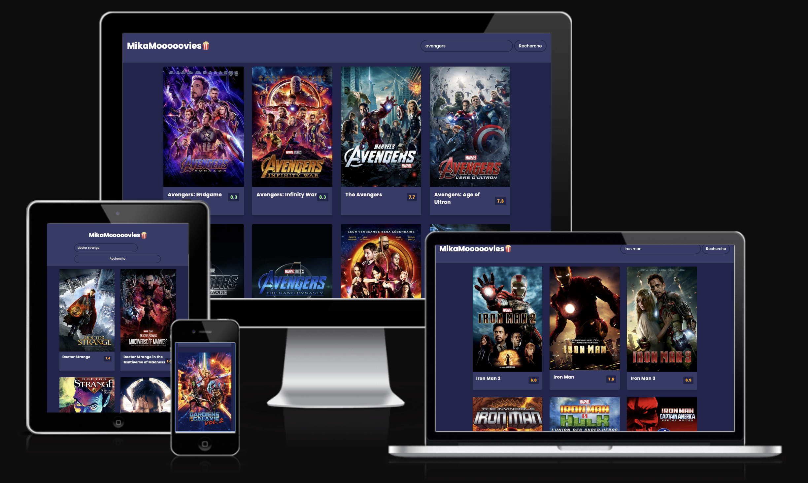

# Movie-Search-App

[Visitez le site](https://movie-search-app.mtdevweb.com/)

## 1. Introduction

Ce site permet de rechercher des films et d'afficher les résultats.

## 2. Comment est il construit ?

Il est construit en HTML, CSS & JavaScript avec l'utilisation de l'API [TMDB API](https://developers.themoviedb.org/3).

### Et Responsive testé avec 

[UI.dev](https://ui.dev/amiresponsive?url=https://movie-search-app.mtdevweb.com)

## 3. Comment l'utiliser ?

A l'arrivée sur le site, les films populaires du moment sont affichés. Il est possible de rechercher un film en tapant son nom dans la barre de recherche et de cliquer sur le bouton "Rechercher" ou de taper sur la touche "Entrée" de son clavier.

## 4. Comment le lancer ?

Il suffit de télécharger le dossier et de l'ouvrir dans un navigateur.

## 5. Comment contribuer ?

Il est possible de contribuer en proposant des améliorations ou des corrections. Pour cela, il suffit de faire un fork du répertoire, apportez vos modifications et soumettez une pull request.

## 6. License

This project is licensed under the MIT License - see the [LICENSE.md](LICENSE.md) file for details

---

### TP-Javascript - Movie Search App - 2022 [Diginamic](https://www.diginamic.fr/)
